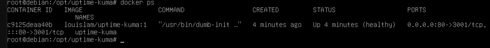
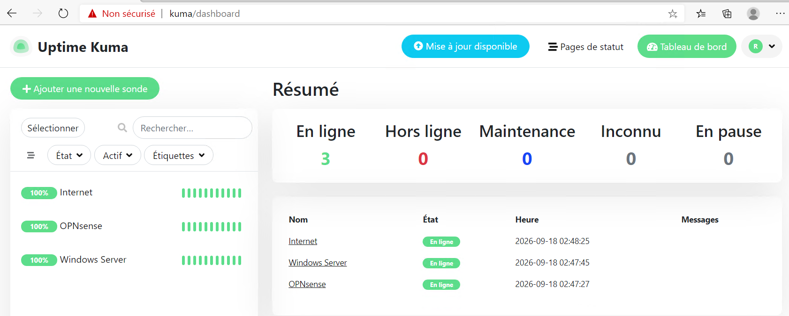

# Debian Server

Debian is used as the Linux server of the laboratory.

## Network

The server uses a static IP configuration.

## Connectivity Tests

The following tests were successfully performed:

- Debian → OPNsense
- Debian → Windows Server
- Debian → Internet
- DNS resolution

## Services (Docker & Containers)

Docker and Docker Compose are installed on this server to host infrastructure services. 

### Deployed Containers: Uptime Kuma
A monitoring dashboard is actively running to check the status of the lab's critical nodes.
- **Access:** `http://kuma` (Mapped via Windows Server DNS to port 80)
- **Monitored Nodes:** OPNsense (Gateway), Windows Server (AD/DNS), and Internet connectivity.
- **Volumes:** Persistent data stored in `/opt/uptime-kuma/data`.

**Active Containers Overview:**

### Dashboard Overview
The Uptime Kuma web interface is used to check if the infrastructure is running.

## Future VLAN Integration

The Debian server will also be used to validate network segmentation and firewall policies after VLAN implementation.
