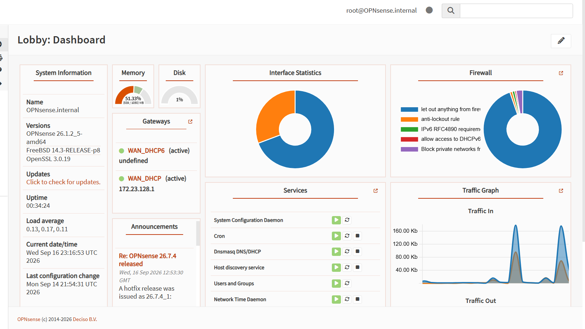
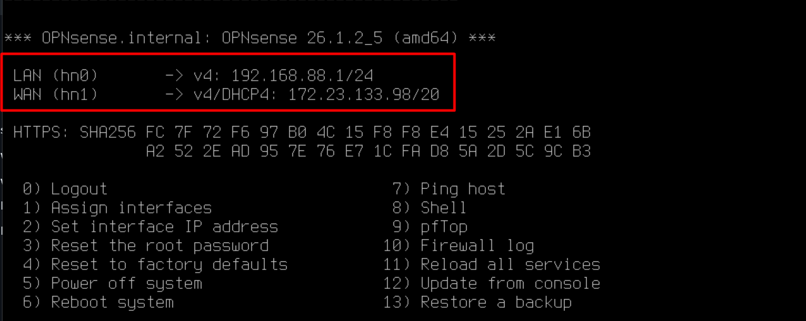
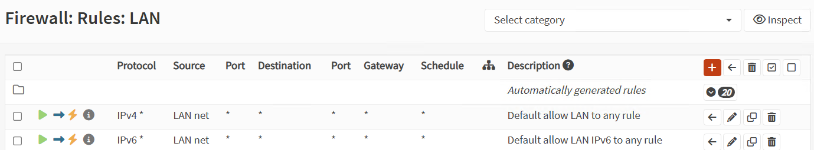

# OPNsense Configuration

## 1. OPNsense Installation

OPNsense was deployed as the firewall and gateway of the virtualized network using Microsoft Hyper-V.

The firewall provides routing and network access control between the internal network and the WAN.

---

## 2. LAN Configuration

The OPNsense LAN interface was configured with the following static IP address:

`192.168.88.1`

This address is used as the default gateway for the internal network.

---

## 3. Firewall Configuration

Firewall rules were configured to control traffic originating from the LAN network.

The default LAN rules allow IPv4 and IPv6 traffic from the internal network to other destinations.

---

## 4. Firewall Traffic Monitoring

OPNsense Live View was used to monitor firewall traffic and verify that network communication was being processed correctly.

Traffic generated by the Windows 11 clients was observed in the firewall logs during connectivity tests.

---

## 5. Network Connectivity Validation

The firewall configuration was validated through connectivity tests between the different virtual machines.

The following communication was successfully tested:

- Windows 11 → Windows Server
- Windows 11 → Debian
- Windows 11 → OPNsense
- Debian → Windows Server
- Debian → Internet

These tests confirmed that OPNsense was correctly routing traffic and enforcing the configured firewall policy.
