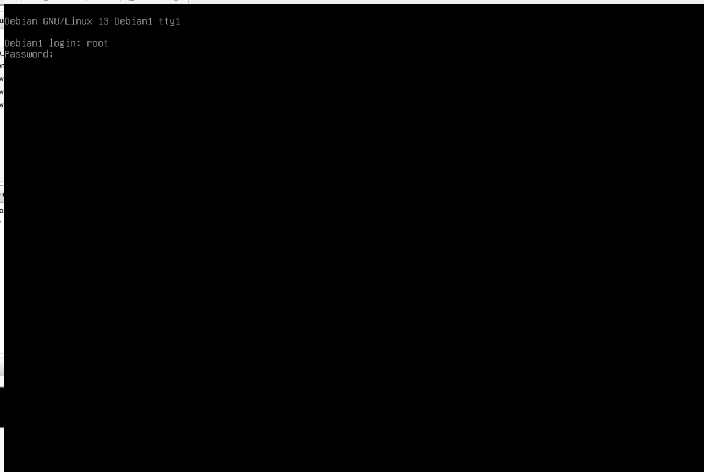
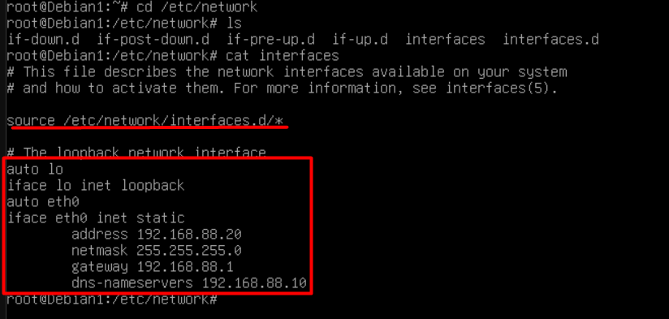
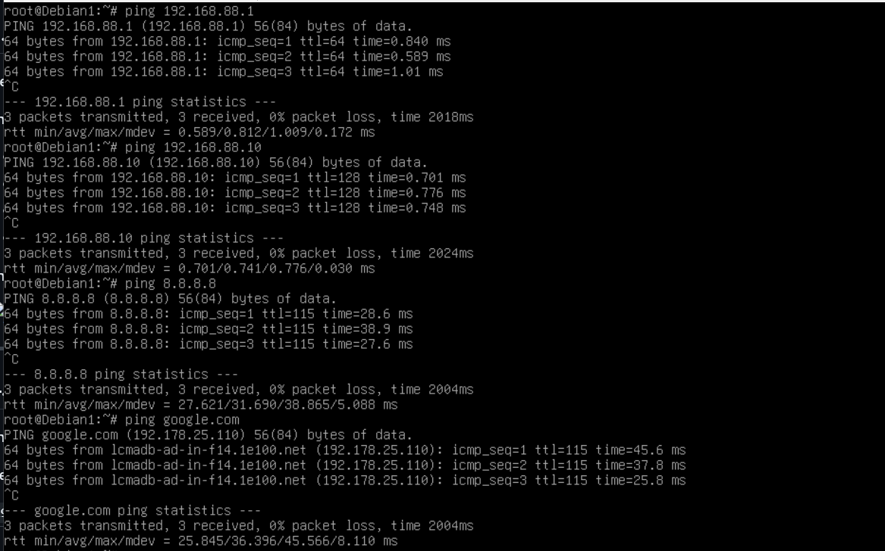
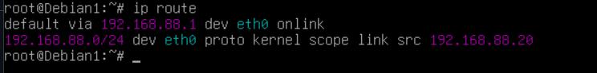

# Debian Configuration

## 1. Debian Installation

A Debian virtual machine was deployed using Microsoft Hyper-V.

The virtual machine was connected to the internal network managed by OPNsense.

---

## 2. Network Configuration

The Debian server was configured with a static IP address:

`192.168.88.20`

The default gateway is OPNsense:

`192.168.88.1`

The DNS server is the Windows Server:

`192.168.88.10`

The network configuration was made persistent using `/etc/network/interfaces`.

---

## 3. Network Connectivity

Network connectivity was tested from the Debian server.

The following destinations were successfully tested:

- OPNsense (`192.168.88.1`)
- Windows Server (`192.168.88.10`)
- Internet (`8.8.8.8`)
- DNS resolution (`google.com`)

These tests confirmed that the Debian server was correctly integrated into the internal network.

---

## 4. DNS Configuration

The Windows Server was configured as the DNS server for the internal network.

Debian uses the Windows Server at:

`192.168.88.10`

for DNS resolution.

DNS resolution was validated by resolving external domains from Debian.

---

## 5. Routing and Gateway

The default gateway configured on Debian is:

`192.168.88.1`

This allows the server to reach external networks through OPNsense.

The routing configuration was verified using standard Linux network commands.

P.S: I know I didnt't do almost anything with the debian server right now, thats why I want to put docker later so it can be useful...
