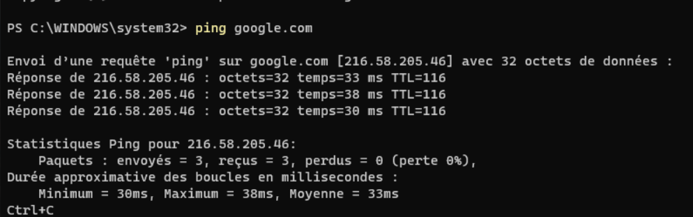
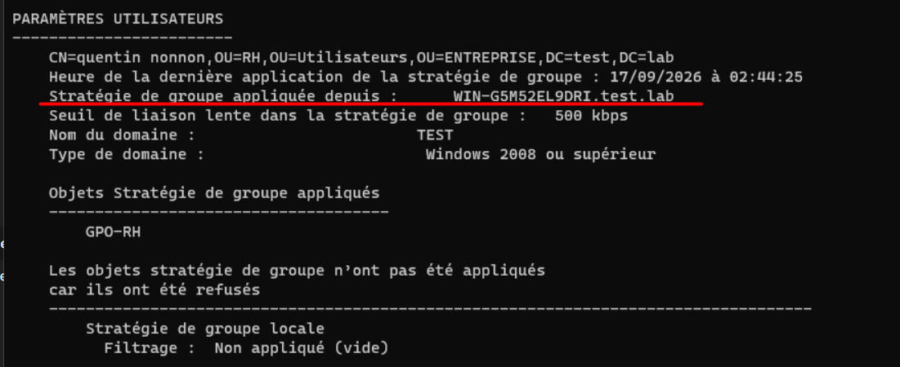
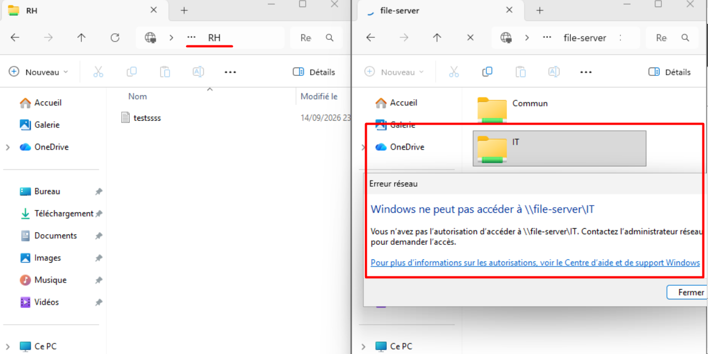
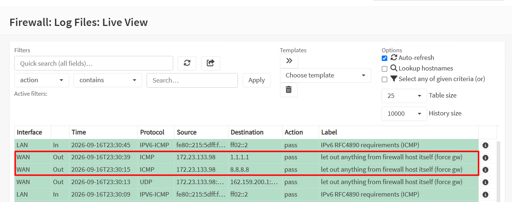

# Validation and Testing

The infrastructure was validated through a series of connectivity, authentication, firewall and access-control tests.

## 1. Network Connectivity

Connectivity between the different virtual machines was tested using ICMP.

The following tests were successfully performed:

| Source | Destination | Result |
|---|---|---|
| Windows 11 Client | OPNsense (`192.168.88.1`) | Success |
| Windows 11 Client | Windows Server (`192.168.88.10`) | Success |
| Windows 11 Client | Debian (`192.168.88.20`) | Success |
| Debian | OPNsense (`192.168.88.1`) | Success |
| Debian | Windows Server (`192.168.88.10`) | Success |
| Debian | Internet (`8.8.8.8`) | Success |

---

## 2. DNS Resolution

DNS resolution was tested from the Debian server and Windows 11 clients.

The Windows Server acts as the DNS server for the Active Directory environment.

External DNS resolution was successfully verified using:

`google.com`

---

## 3. DHCP Validation

The Windows 11 clients successfully received their network configuration through DHCP.

The assigned configuration included:

- IP address
- Subnet mask
- Default gateway
- DNS server

The clients were therefore able to communicate with the internal infrastructure without manually configuring their IP addresses.

---

## 4. Active Directory Authentication

Domain user accounts were tested from the Windows 11 clients.

Users were able to authenticate against the Active Directory domain using their assigned credentials.

The correct Organizational Unit and Group Policy configuration were also verified.

---

## 5. Group Policy Validation

The configured Group Policy Objects were tested from the Windows 11 clients.

The policies were successfully applied to the appropriate users and/or computers according to their Organizational Unit.

---

## 6. File Server Access Control

The SMB shares were tested using different domain accounts.

### IT User

The IT user successfully accessed:

- `Commun`
- `IT`

Access to `RH` was denied.

### HR User

The HR user successfully accessed:

- `Commun`
- `RH`

Access to `IT` was denied.

---

## 7. Firewall Validation

OPNsense firewall logs were monitored during network connectivity tests.

ICMP traffic generated by the virtual machines was observed in the firewall Live View when traffic passed through the firewall.

This confirmed that OPNsense was processing and logging network traffic correctly.

---

## 8. Final Validation

The validation phase confirmed the correct operation of the main infrastructure components:

- OPNsense firewall and gateway
- Windows Server
- Active Directory
- DNS
- DHCP
- Group Policy
- SMB file sharing
- NTFS permissions
- Windows 11 domain clients
- Debian server

The infrastructure was tested from both Windows and Linux systems to verify connectivity, authentication, name resolution and access control.
