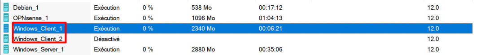
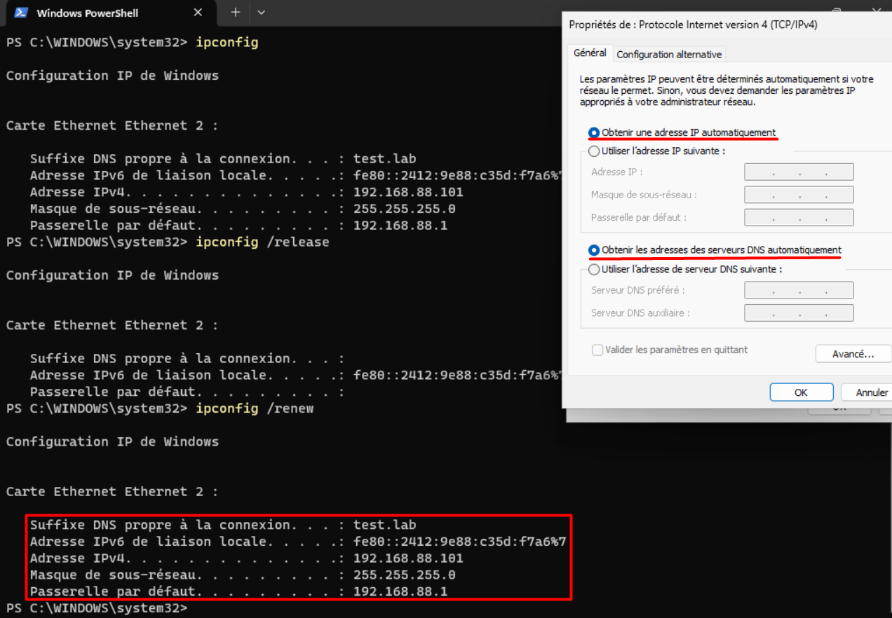
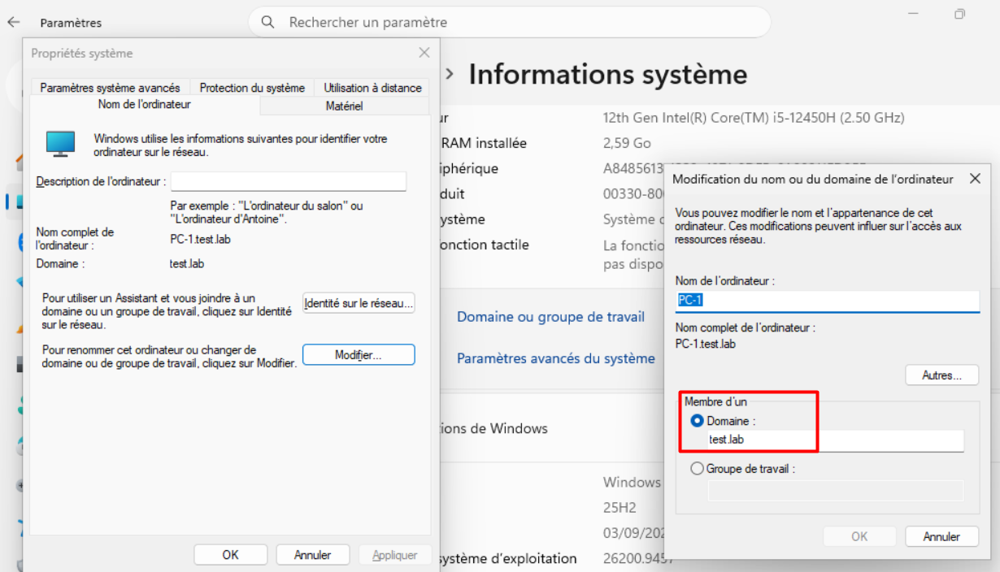
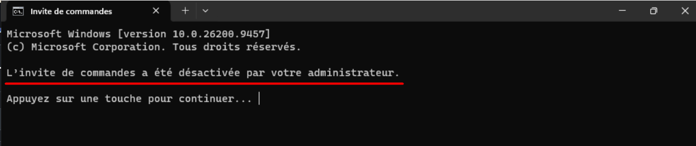
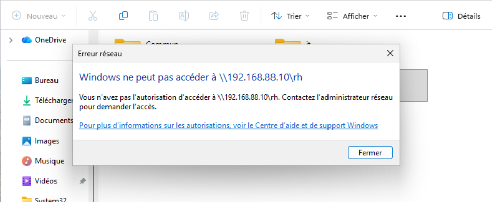

# Windows 11 Clients Configuration

## 1. Client Deployment

Two Windows 11 virtual machines were deployed using Microsoft Hyper-V.

Both clients were connected to the internal network managed by OPNsense.

---

## 2. Network Configuration

The Windows 11 clients receive their network configuration dynamically through DHCP.

The DHCP server provides the required IP address, subnet mask, default gateway and DNS server.

---

## 3. Domain Join

Both Windows 11 clients were joined to the Active Directory domain hosted on the Windows Server.

This allows the machines to authenticate domain users and receive centralized configuration through Group Policy.

---

## 4. Group Policy Validation

Group Policy Objects configured on the Windows Server were applied to the Windows 11 clients.

The policies were verified from the clients after logging in with domain accounts.

---

## 5. File Server Access

Access to the SMB shares was tested using different domain accounts.

The tests confirmed that users could access the resources authorized for their department while unauthorized access was denied.

### RH User

The RH user was able to access:

- `RH`
- `Commun`

Access to `IT` was denied.

### IT User

The HR user was able to access:

- `IT`
- `Commun`

Access to `IT` was denied.

---

## 6. Connectivity Tests

Network connectivity was validated from the Windows 11 clients.

The clients were able to communicate with:

- OPNsense (`192.168.88.1`)
- Windows Server (`192.168.88.10`)
- Debian (`192.168.88.20`)
- Internet resources

Thesed tests confirmed that the clients were correctly integrated into the network infrastructure.
